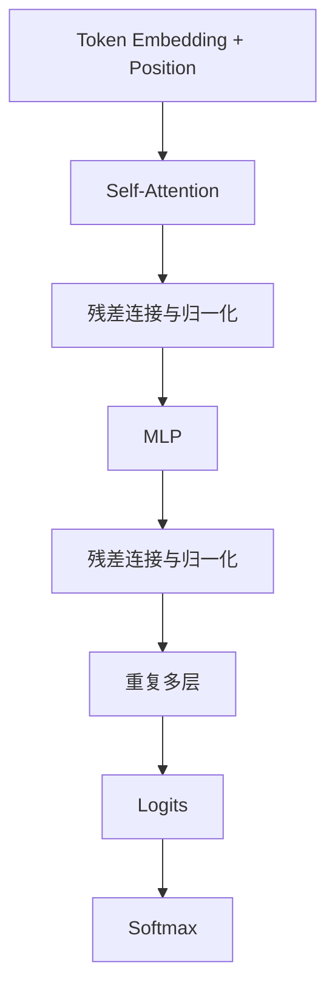
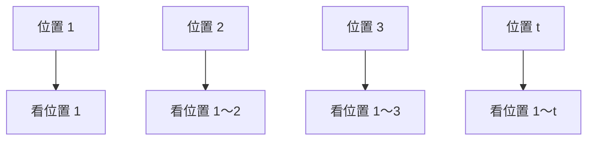
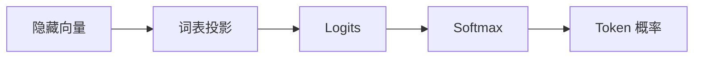

文本已经被转换成 Token ID，但整数本身没有语义。
Transformer 的任务，是把这些离散编号转换成上下文相关的内部表示，再预测下一个 Token。
理解 Transformer，需要抓住两个核心组件：Attention 和 MLP。

## 一、一张图看懂 Transformer 的分工

理解 Transformer，不必一开始就陷进矩阵公式。先看清信息在一个 Block 里怎样流动，以及 Attention 和 MLP 分别负责什么。
一个 Transformer Block 可以简化为：



可以先记住一个分工：Attention 负责不同位置之间的信息交流，MLP 负责每个位置内部的非线性计算。
后面的公式，只是在解释这两个过程具体如何实现。

## 二、从 Token ID 到向量

Token ID 只是词表索引。
模型首先通过 Embedding 表，把每个 ID 映射成高维向量：

```math
\text{Token ID}\rightarrow\mathbf{x}\in\mathbb{R}^d
```

如果隐藏维度为 4,096，每个 Token 就会被表示为一个包含 4,096 个数值的向量。
这些向量会随着训练不断调整。

## 三、为什么需要位置信息？

假设有两句话：

```text
狗追猫
猫追狗
```

它们包含相同的字，但顺序不同，意义也完全不同。
如果模型只看到 Token 集合，而不知道位置，就无法区分这两句话。
因此，模型需要加入位置编码或旋转位置编码等机制。

## 四、Self-Attention 解决什么问题？

句子中的一个 Token，经常需要读取其他位置的信息。
例如：

```text
小明把杯子放到桌子上，因为它很稳。
```

模型需要判断“它”更可能指桌子，而不是杯子。
Self-Attention 允许当前 Token 根据任务，从其他位置加权读取信息。

## 五、Query、Key 和 Value

每个 Token 的表示会生成三个向量：

- Query：我正在寻找什么？
- Key：我具有什么可匹配特征？
- Value：如果被关注，我要提供什么内容？

注意力计算为：

```math
\text{Attention}(Q,K,V) = \text{softmax} \left( \frac{QK^\top}{\sqrt{d_k}} \right)V
```

Query 与 Key 决定匹配程度。
匹配结果经过 Softmax 后，成为 Value 的加权系数。

## 六、Attention 的计算过程

可以把一次注意力计算理解成四步。
第一步，当前 Token 生成 Query。
第二步，Query 与所有可见位置的 Key 计算相似度。
第三步，相似度被转换成注意力权重。
第四步，使用这些权重对所有 Value 加权求和。
最终，当前 Token 获得融合上下文后的新表示。

## 七、为什么要除以 `\sqrt{d_k}`？

向量维度较大时，Query 与 Key 的点积可能变得很大。
过大的数值会让 Softmax 过度尖锐，导致梯度不稳定。

除以 `\sqrt{d_k}` 可以控制数值尺度。

## 八、什么是多头注意力？

单个注意力头只能产生一种匹配模式。
多头注意力会并行执行多组 Q、K、V 投影。
不同头可能分别关注：

- 主谓一致
- 指代关系
- 句子边界
- 代码变量
- 长距离依赖
- 相邻词组合

这些头的输出会被拼接，再投影回模型隐藏维度。

## 九、为什么需要因果遮罩？

训练生成模型时，位置 `t` 不能偷看位置 `t+1` 之后的答案。



因果遮罩会把未来位置的注意力分数设为不可选状态。
这样，训练时的信息限制与真实生成保持一致。

## 十、MLP 在做什么？

Attention 负责让不同 Token 位置交换信息。
MLP 则在每个位置上独立执行非线性变换。
一个简化的 MLP 可能是：

```math
\text{MLP}(x)=W_2\sigma(W_1x)
```

第一层扩大维度，激活函数引入非线性，第二层再压回隐藏维度。

## 十一、残差连接

残差连接把模块输出加回原始输入：

```math
x_{\text{new}}=x+f(x)
```

这允许网络保留原有信息，同时逐层增加新计算结果。
残差连接也能改善深层网络中的梯度传播。

## 十二、LayerNorm 与 RMSNorm

模型中的数值尺度可能随着层数增加而变得不稳定。
归一化层会调整向量的统计范围，使训练更加稳定。
现代模型可能使用 LayerNorm、RMSNorm 或不同的归一化位置设计。

## 十三、Logits 是什么？

经过多层 Transformer 后，每个位置会得到一个隐藏向量。
最后的线性层将这个向量投影到词表大小，产生每个候选 Token 的 Logit。
Softmax 再将 Logits 转换为概率。



## 十四、Transformer 是否真的存储知识？

模型知识分散在：

- Embedding
- Attention 投影
- MLP 参数
- 残差流
- 多层之间的组合

不能简单地说“知识全部存在 MLP”或“推理全部发生在 Attention”。
模型能力是整个参数系统共同作用的结果。

## 十五、KV Cache 为什么能加速生成？

自回归生成时，旧 Token 的 Key 和 Value 不需要每一步都重新计算。
系统可以把它们保存到 KV Cache 中。
生成新 Token 时，只计算新位置的表示，再读取缓存中的历史 K/V。

KV Cache 能显著加速生成，却会占用大量显存。

## 十六、上下文越长，计算为何越贵？

标准 Attention 需要比较多个 Token 位置。
序列长度增加时，注意力矩阵会迅速变大。
因此，长上下文不仅占用更多内存，也会增加推理时间。
各种稀疏注意力、滑动窗口和缓存技术，都在尝试降低这个成本。

## 本篇总结

1. Embedding 把 Token ID 转换成向量。
2. 位置信息让模型理解顺序。
3. Attention 负责跨位置读取信息。
4. MLP 负责位置内部的非线性计算。
5. 因果遮罩阻止模型偷看未来答案。
6. 残差和归一化让深层网络稳定。
7. KV Cache 加速生成，但会消耗显存。
