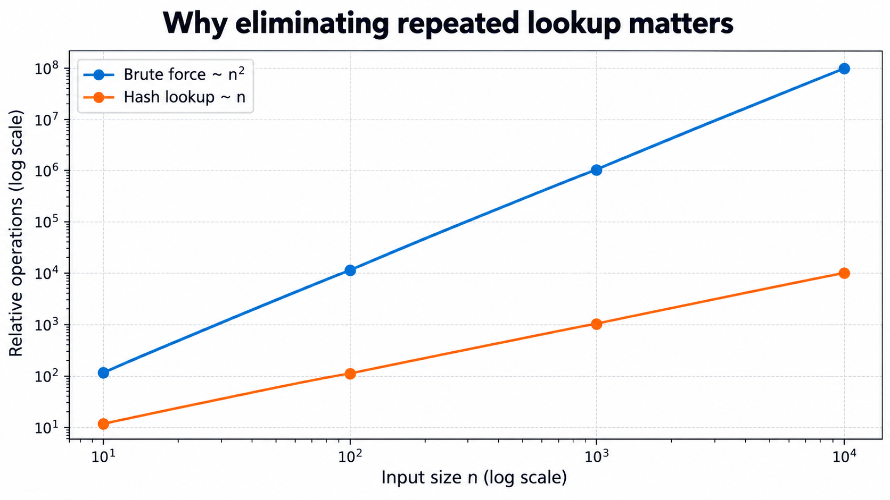
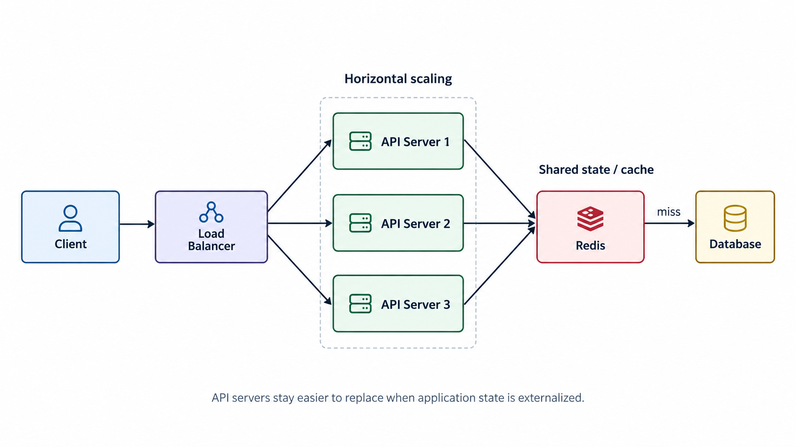
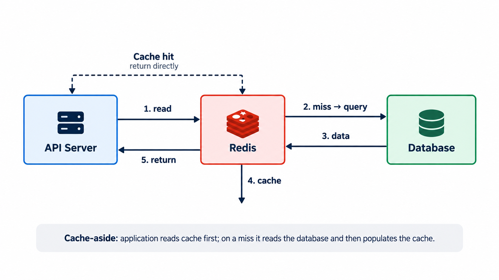
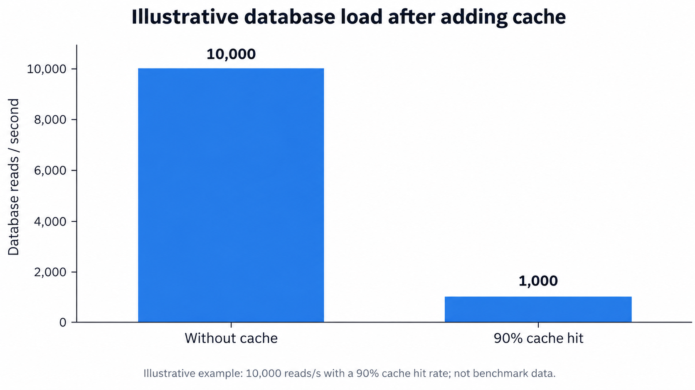

> **31 Days of DSA & System Design**  
> 每天 1 小时 DSA + 1 小时 System Design。第一天我没有试图记住更多“标准答案”，而是刻意追问两个问题：**当前方案为什么慢？新的工具到底解决了哪一个瓶颈？**

今天最大的收获可以先压缩成一句话：

> **Two Sum 里的 HashMap 和系统设计里的水平扩展，本质上都不是“应该背的答案”，而是当前方案出现瓶颈之后自然长出来的解决方案。**


## 1. DSA：我会写暴力解法，但为什么没有自然想到 HashMap？

第一题是 LeetCode 1：**Two Sum**。给定一个整数数组和 `target`，寻找两个元素，使它们的和等于 `target`，并返回两个下标。

最直接的解法是双重循环：

```ts
function twoSum(nums: number[], target: number): number[] {
  for (let i = 0; i < nums.length; i++) {
    for (let j = i + 1; j < nums.length; j++) {
      if (nums[i] + nums[j] === target) {
        return [i, j]
      }
    }
  }
  return []
}
```

代码没有错，问题是时间复杂度为 `O(n²)`。我真正卡住的不是“HashMap 怎么写”，而是：**为什么这道题应该想到 HashMap？**

### 第二层循环到底在做什么？

假设当前元素是 `2`，`target = 9`。第二层循环其实只是在找一件东西：

```text
9 - 2 = 7
```

换句话说，对于当前元素 `x`，我需要回答：

> `target - x` 之前有没有出现过？如果出现过，它的下标是多少？

一旦问题被改写成这个形式，HashMap 就不再像一个凭空出现的技巧。它刚好可以保存：

```text
number → index
```

于是单次“寻找另一个数字”的成本，从遍历数组的 `O(n)`，变成平均 `O(1)` 的哈希查询。

```ts
function twoSum(nums: number[], target: number): number[] {
  const seen = new Map<number, number>()

  for (let i = 0; i < nums.length; i++) {
    const complement = target - nums[i]
    const index = seen.get(complement)

    if (index !== undefined) {
      return [index, i]
    }

    seen.set(nums[i], i)
  }

  return []
}
```




### HashMap 与 HashSet：我今天建立的判断方式

第二题 **Contains Duplicate** 只问“一个数字以前出现过吗”，不要求下标，因此连 `key → value` 都不需要，直接用 HashSet：

```ts
function containsDuplicate(nums: number[]): boolean {
  const seen = new Set<number>()

  for (const num of nums) {
    if (seen.has(num)) return true
    seen.add(num)
  }

  return false
}
```

| 我真正需要回答的问题 | 更自然的数据结构 | 例子 |
|---|---|---|
| 这个元素以前出现过吗？ | `Set` | Contains Duplicate |
| 这个元素出现过吗？如果出现过，还要拿到相关信息 | `Map` | Two Sum 中的 `number → index` |

今天真正应该记住的并不是“两数之和 = HashMap”，而是这个思考顺序：

> **暴力方案是否在重复搜索？如果是，我能否把已经见过的信息保存起来，从而把未来的搜索变成快速查询？**


## 2. System Design：从一个最简单的用户 API 开始

系统设计部分，我从一个极简接口开始：

```http
GET /users/123
```

第一版架构没有任何花哨的组件：

```text
Client → API Server → Database
```

接下来只问一件事：**如果流量继续增长，这个系统会在哪里先撑不住？**

### 先统一三个基础指标

| 指标 | 我现在的理解 | 例子 |
|---|---|---|
| Latency | 一次请求从发出到收到响应所花的时间 | `120 ms` |
| Throughput | 单位时间完成的工作量 | `5000 requests/s` |
| QPS | 每秒处理的请求数量，是 throughput 的一种具体表达 | `5000 QPS` |

假设网站每天有 `10,000,000` 次请求，平均 QPS 约为 `116`。但系统不能只按平均值设计，因为真实流量通常有峰谷：凌晨可能几十 QPS，晚高峰却可能突然达到几百甚至上千 QPS。

---

## 3. 单机不够以后，架构为什么会一步一步长出来？

假设一台 API Server 大约只能承受 `300 QPS`，而峰值流量逐渐逼近 `1000 QPS`。此时有两个最直接的方向：

| 方案 | 做法 | 优点 | 主要限制 |
|---|---|---|---|
| Vertical Scaling | 给单机更多 CPU / RAM / 更快磁盘 | 简单，架构变化小 | 单机有上限，成本会越来越高 |
| Horizontal Scaling | 增加更多服务器 | 更容易继续扩容，也方便冗余 | 会引入负载分配、状态共享等新问题 |

当服务器从一台变成多台以后，客户端不能自己决定每个请求应该落到哪台机器，于是需要 Load Balancer。与此同时，如果用户 session 只存在某一台 API Server 的内存里，下一次请求落到另一台机器时就会出现“明明刚登录，却又像没登录”的问题。

因此，**负载均衡、无状态 API、共享状态**不是三个孤立的知识点，它们是水平扩展之后连续出现的问题和解法。




这张图对我很重要，因为它把几个概念串成了一个完整故事：

1. 流量上涨，单台 API Server 不够；
2. 增加服务器数量；
3. Load Balancer 负责分配请求；
4. API Server 尽量保持 stateless；
5. 需要共享的数据和缓存放到外部存储；
6. 应用层扩起来以后，数据库会成为新的瓶颈。


## 4. 为什么系统接近容量上限时，Latency 会突然变差？

假设有 3 台 API Server，每台最多大约处理 `300 QPS`，理论容量约为 `900 QPS`。如果突然进入 `1200 QPS` 的流量，即使 Load Balancer 使用 Round Robin，每台机器仍然大约要承受 `400 QPS`。

问题不只是“多出来 100 QPS”。更典型的过程是：

```text
请求到达速度 > 请求处理速度
        ↓
请求开始排队
        ↓
Queue 越来越长
        ↓
Latency 上升
        ↓
线程 / 连接池 / CPU 等资源接近饱和
        ↓
Timeout 与 5xx 增加
```

这让我意识到：**负载均衡只能把流量分散，不能凭空制造处理能力。** 而且 Round Robin 更接近“请求数量平均”，并不意味着每台机器实际承担的工作量完全相同；一个轻量 `GET` 和一个耗时数秒的报表请求，对服务器的成本显然不同。


## 5. Auto Scaling 与 Serverless：先理解抽象，再选具体方案

如果流量每天都明显变化，比如凌晨 `50 QPS`、白天 `200 QPS`、晚高峰 `1200 QPS`，一直固定开很多实例会浪费资源。因此更自然的方案是 **Auto Scaling**：负载上涨时增加实例，负载下降后缩容。

我一开始想到的是 Serverless。这个方向并不错误，但今天我更清楚地认识到：

> **Auto Scaling 是要解决的问题；Serverless 是实现弹性的一种方式。**

Serverless 还会带来 cold start、执行限制、数据库连接突增、长连接适配等 trade-off，所以不能把它简单理解成“流量少就便宜、流量多就自动扩，一定更好”。


## 6. 应用层扩起来之后，为什么数据库会成为新瓶颈？

API Server 可以从 3 台增加到 30 台，但如果它们最终都访问同一个 Database，瓶颈只会从应用层移动到数据层。

数据库可能被这些资源限制：

- CPU / Memory
- Disk I/O 与 IOPS
- Connection Pool
- Lock Contention
- Index 效率
- Network

典型链路是：

```text
DB Load ↑
→ Query Latency ↑
→ API 等待 DB 的时间 ↑
→ API Latency ↑
→ Timeout / Error Rate ↑
```

这也是我今天最重要的系统设计认知之一：

> **解决一个瓶颈，并不等于系统“没有瓶颈”了；瓶颈通常只是移动到了下一个组件。**


## 7. Redis Cache 为什么会自然出现？

如果 `GET /users/123` 是一个典型的读多写少接口，大量请求不断读取相同 profile，而资料可能几个小时都没有变化，那么每次都访问数据库就属于明显的重复工作。

这和 Two Sum 里的暴力搜索有点像：**明明刚刚拿到过的信息，却每次都重新做昂贵查询。**

一种常见的 Cache-Aside 流程如下：



如果数据库原本要处理 `10,000 reads/s`，而缓存命中率达到 90%，理想情况下真正落到数据库的读取可能下降到约 `1,000 reads/s`：



Cache 因此同时帮助了两件事：

- 减少数据库负载；
- 对命中请求降低 latency。

但代价也马上出现。如果 Database 里的用户名字已经从 `Alice` 更新成 `Bob`，而 Redis 里仍然是旧值 `Alice`，下一次 cache hit 就可能返回 stale data。

因此后续必须继续回答：

| 新问题 | 后面需要继续学习的主题 |
|---|---|
| 缓存什么时候失效？ | TTL / Eviction |
| 更新数据时删缓存还是更新缓存？ | Cache invalidation |
| Redis 挂了怎么办？ | High availability / Fallback |
| 大量请求同时 miss 怎么办？ | Cache stampede |
| 某个 key 特别热怎么办？ | Hot key |

我今天没有继续展开这些问题。第一天更重要的是理解：**为什么架构会自然走到需要 Cache 的这一步。**


## 8. 今天最有价值的连接：DSA 和 System Design 在训练同一种思维

把今天两个小时放在一起看，我发现它们其实有同一个骨架：

| DSA | System Design |
|---|---|
| 双重循环不断重复搜索 | 单台服务 / 数据库不断承担重复或过量工作 |
| 找到 `O(n²)` 的来源 | 找到 latency / saturation 的来源 |
| 用 HashMap 保存已经见过的信息 | 用扩容、LB、缓存等组件重新分配或保存信息 |
| `O(n²) → O(n)` | 降低某个组件负载、提升容量或降低延迟 |
| 需要考虑额外空间 | 需要考虑一致性、成本、故障等 trade-off |

所以我现在更愿意把今天的学习总结成下面这条 mental model：

```text
观察当前方案
    ↓
找到真正的瓶颈
    ↓
理解瓶颈为什么存在
    ↓
引入一个刚好解决它的工具
    ↓
重新观察新的瓶颈和 trade-off
```

## 今日总结

**DSA**

- Two Sum 的关键不是“背 HashMap”，而是发现第二层循环在做重复搜索。
- 只关心 existence 时使用 Set；还需要额外关联信息时考虑 Map。
- HashMap / HashSet 的价值，是用额外空间换取更快的查询。

**System Design**

- Latency 描述单次请求耗时，QPS 描述每秒处理的请求量。
- 单机容量不足后，可以考虑垂直扩展或水平扩展。
- 水平扩展自然引出 Load Balancer、Stateless Service 和共享状态。
- 应用层扩起来之后，数据库可能成为下一处瓶颈。
- Cache 可以减少重复读取，但会引入一致性和失效策略等新问题。
