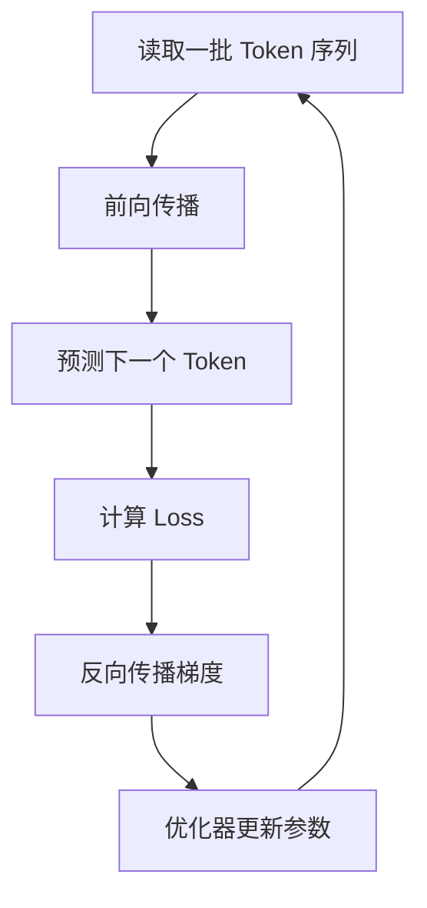
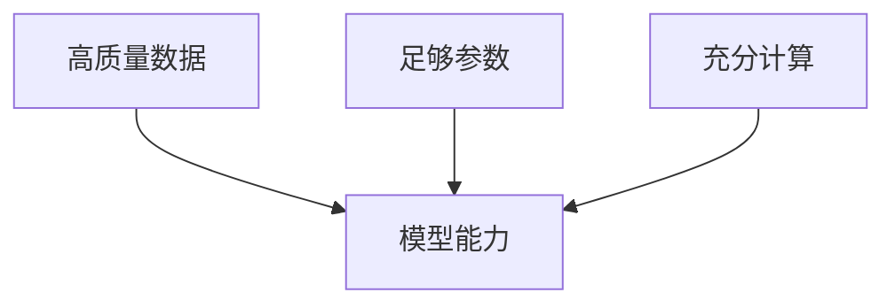

Transformer 定义了模型如何计算，但刚初始化的 Transformer 什么也不会。
它的参数接近随机，输出也近似随机。
模型必须经过大量训练，才能把互联网数据中的模式压缩进参数。

## 把训练想成一个纠错循环

刚初始化的模型会给出近乎随机的预测。训练要做的，就是不断比较“模型猜了什么”和“正确 Token 是什么”，再沿着误差反向调整参数。
一次训练迭代可以概括为：



这个纠错循环会在大规模 GPU 集群上重复极多次。单次更新很小，但海量更新累积起来，模型就逐渐掌握语言、知识和任务模式。

## 训练数据如何构造输入和答案？

假设 Token 序列是：
```text
[x1, x2, x3, x4, x5]
```
输入可以是：
```text
[x1, x2, x3, x4]
```
训练目标是：

```text
[x2, x3, x4, x5]
```
模型在每个位置预测它右边的真实 Token。

## 前向传播
Token ID 先经过 Embedding，再依次通过多层 Transformer。
最后，每个位置都会输出词表上的 Logits。
Softmax 把 Logits 转换成概率分布。
前向传播的结果，就是模型在当前参数下做出的预测。

## 交叉熵损失

如果正确 Token 的预测概率为 `p`，损失可以写成：
```math
L=-\log p
```

当正确答案概率很高时，损失较小。
当正确答案概率很低时，损失较大。
整个批次的损失会对不同 Token 位置进行平均或加权汇总。

## 反向传播

反向传播使用链式法则，计算损失对每个参数的梯度。
梯度告诉系统：
> 如果稍微改变这个参数，损失会向哪个方向变化？
模型可能拥有数十亿个参数，反向传播会为它们计算相应的梯度。

## 优化器如何更新参数？

最简单的更新方式为：

```math
\theta\leftarrow\theta-\eta\nabla_\theta L
```
其中：

- `\theta` 表示参数。
- `\eta` 表示学习率。
- `\nabla_\theta L` 表示损失梯度。

实际训练通常使用 AdamW 等优化器。

## 学习率为什么重要？

学习率太大，参数更新可能反复越过最佳区域，甚至导致训练发散。
学习率太小，训练会非常缓慢，也可能无法充分利用计算预算。
常见策略包括：

- 学习率预热
- 峰值学习率
- 余弦衰减
- 分阶段学习率
- 梯度裁剪

## 什么是 Batch？

训练不会一次只处理一个序列。
系统会把多个序列组成 Batch，并行计算预测和梯度。
更大的 Batch 可以提高硬件利用率，却会增加显存需求，也可能改变优化动态。

## 为什么需要混合精度？

模型参数和计算可以使用 FP32、FP16、BF16 等不同数值格式。
较低精度可以减少显存占用，并提高计算速度。
但精度太低可能导致溢出、下溢和训练不稳定。
因此，训练系统通常混合使用不同精度。

## 单张 GPU 为什么装不下大模型？

训练时需要保存：
- 模型参数
- 梯度
- 优化器状态
- 中间激活值
- KV 或临时计算结果

优化器状态的体积可能大于参数本身。
数十亿参数模型很快就会超过单张 GPU 的显存。

## 数据并行

数据并行让多张 GPU 保存相同模型，但处理不同训练样本。
每张 GPU 计算自己的梯度，再通过通信进行聚合。
它适合模型本身能放入单张 GPU，但 Batch 很大的情况。

## 张量并行

张量并行把单个矩阵运算拆到多张 GPU。
例如，一个大型线性层的权重矩阵可以按行或按列分割。
这种方式允许单层模型超过单张 GPU 的容量。

## 流水线并行

流水线并行把不同模型层分配到不同 GPU。
一个 Batch 在前几层计算后，把中间结果传给后续 GPU。
它可以容纳更深模型，却会产生流水线空闲和调度问题。

## 检查点和故障恢复

大型训练可能持续数周或数月。
系统必须定期保存：

- 模型参数
- 优化器状态
- 学习率状态
- 数据读取位置
- 随机数状态

如果硬件故障，可以从检查点继续，而不是从头训练。

## 数据、参数和计算

模型能力依赖三个核心资源：



参数很大但数据不足，模型无法充分学习。
数据很多但模型太小，模型容量会成为瓶颈。
二者都大但训练计算不足，模型也无法充分收敛。

## Scaling Law 的直觉

在一定范围内，模型规模、数据量和计算量增加时，预测损失会呈现相对规律的下降趋势。
这使团队可以先训练较小模型，再预测更大训练的可能效果。
但 Scaling Law 不是无限保证。
数据质量、架构、后训练和评测方式都会改变实际结果。

## 为什么 GPT-2 是好教材？

GPT-2 已经具备现代 GPT 的核心结构：

- Transformer
- 互联网文本预训练
- 下一个 Token 目标
- 自回归生成
- 上下文学习

它的规模又相对容易理解和复现，因此适合学习完整训练栈。

## 训练 Loss 下降代表什么？

Loss 下降说明模型更善于预测训练分布中的 Token。
它不自动等于：

- 事实更加准确
- 推理更加可靠
- 行为更加安全
- 更会遵循用户指令
- 更符合人类偏好

这些能力还需要专门数据、后训练和评测。

## 验证集为什么重要？

如果只观察训练 Loss，模型可能只是记住训练数据。
验证集由训练中不参与参数更新的数据组成。
验证 Loss 可以帮助判断模型是否具有泛化能力，以及是否出现过拟合。

## 训练结束的模型是什么？

预训练结束后得到的是 Base Model。
它学习了语言、知识和文档模式，却不一定会稳定回答用户问题。
从 Base Model 变成聊天助手，还需要后训练。

## 本篇总结

1. 模型从随机参数开始。
2. 前向传播产生预测。
3. Loss 衡量预测误差。
4. 反向传播计算梯度。
5. 优化器更新参数。
6. 大模型需要复杂的分布式训练。
7. 数据、参数和计算必须协调扩展。
8. 预训练结束后得到的是 Base Model。
