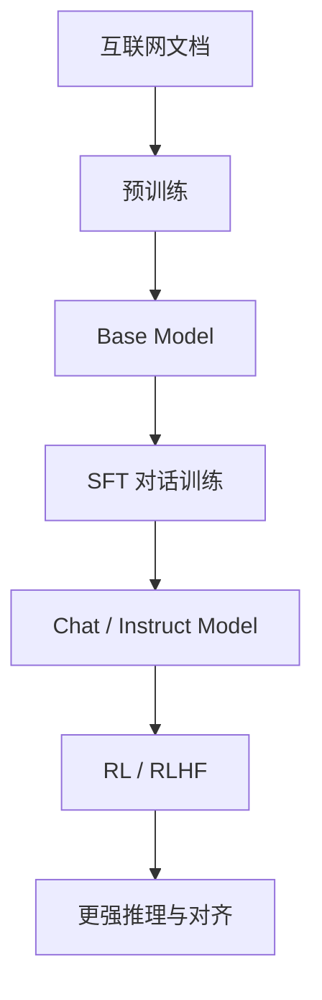
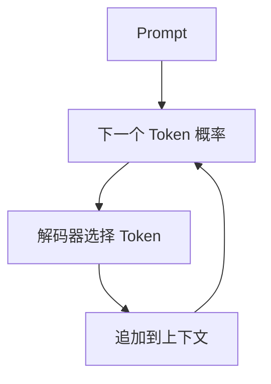

预训练结束后，模型已经学会大量语言和知识。
但如果直接向 Base Model 提问，它不一定会像助手一样回答。
原因很简单：它学习的是“互联网文本如何继续”，而不是“用户提问后应该怎样帮助”。

## 先区分“会续写”和“会帮助”

Base Model 与 ChatGPT 的差别，不只是回答风格不同，而是训练目标不同。
前者学习怎样延续互联网文档，后者还要学习怎样识别用户意图、遵循指令并组织成有帮助的回答。


可以把 Base Model 看成能力底座：预训练提供知识与基础能力，SFT 再把这些能力组织成助手行为，后续的 RL 或 RLHF 继续优化推理与对齐。

## Base Model 是文档模拟器

如果输入：
```text
法国的首都是
```
模型很可能续写“巴黎”。
但如果输入：
```text
请用三句话解释量子力学
```
Base Model 不一定直接回答。
它可能继续生成一份试卷、论坛讨论、网页模板或更多问题。
因为它的训练目标只是模仿文档分布。

## 自回归生成

推理时，模型反复执行：

模型权重通常保持固定。
变化的是不断增长的上下文。

## Temperature 与 Top-p

Temperature 控制概率分布的平坦程度。
- 低温度更稳定。
- 高温度更多样。
- 接近零时接近贪心选择。

Top-p 则从累计概率达到阈值的候选集合中采样。

它可以过滤极低概率 Token，同时保留一定随机性。

## SFT 是什么？

SFT 是监督微调。
训练数据由用户消息和理想助手回答组成：
```text
User:
什么是黑洞？

Assistant:
黑洞是一种引力极强的天体……
```

模型仍然学习预测下一个 Token。
变化的不是训练目标，而是训练文本的类型。

## SFT 数据在教什么？

SFT 数据可以教模型：
- 如何解释概念
- 如何组织答案
- 如何遵循格式
- 如何提出澄清问题
- 如何承认不确定
- 如何拒绝危险请求
- 如何调用工具
- 如何保持合适语气

它是在通过例子隐式定义助手行为。

## 对话角色的底层形式

产品界面中的角色通常包括：
- System
- User
- Assistant
- Tool

这些角色最终会被序列化为特殊 Token 和普通文本。
```text
<system>
你是一个编程助手。
</system>

<user>
请解释快速排序。
</user>

<assistant>
快速排序是一种分治算法……
</assistant>
```

模型并没有四个独立人格。
它只看见一串带有结构标记的 Token。

## System Prompt 有什么作用？

System Prompt 会在当前上下文中说明：
- 助手身份
- 行为原则
- 输出格式
- 可用工具
- 安全边界
- 当前任务环境

它会影响本次推理，却不会永久修改模型参数。

## SFT 为什么需要高质量数据？

SFT 数据量通常小于预训练数据，但质量要求更高。
低质量回答会直接教给模型错误行为，例如：
- 过度自信
- 解释混乱
- 无视约束
- 伪造引用
- 不必要地冗长
- 机械套用模板

SFT 更像行为塑形，因此单条数据的影响可能比普通网页更直接。

## 合成数据的价值与风险

高质量人工数据昂贵，训练团队可能使用更强模型生成候选答案。
合成数据可以扩大规模，却存在风险：

- 错误被复制
- 文风趋同
- 答案过度模板化
- 模型缺陷被继承
- 数据多样性下降

可靠流程通常需要筛选、验证和人工修订。

## 为什么聊天时通常没有继续训练？

用户发送一条消息后，模型一般不会立即修改数十亿参数。
系统只是把消息加入上下文，再进行前向计算。
如果产品保存用户偏好，那通常写入外部数据库。
下一次对话时，系统可能把这些偏好重新放入上下文。

## 上下文学习与 SFT 的区别

| 方式参数是否变化持续时间 |        |          |
| ------------ | ------ | -------- |
| 上下文学习        | 不变化    | 当前上下文    |
| SFT          | 变化     | 跨对话保留    |
| 外部记忆         | 模型参数不变 | 由产品数据库决定 |

不要把模型在一次对话中的适应，误认为它已经永久学会。

## 工具调用如何工作？

工具调用通常是一种结构化生成协议。
模型可能生成：

```json
{
  "tool": "search",
  "arguments": {
    "query": "台北今天的天气"
  }
}
```

产品运行时解析这个结构，执行搜索，再把结果放回上下文。
模型随后根据工具结果生成最终回答。

## 为什么工具调用需要专门训练？

模型必须学会：

- 什么时候调用工具
- 选择哪个工具
- 如何填写参数
- 如何读取返回结果
- 什么时候停止调用
- 如何处理工具错误

这些行为可以通过 SFT、强化学习和真实执行反馈进行训练。

## Base、Instruct 与 Chat 的区别

| 模型类型主要特点  |               |
| --------- | ------------- |
| Base      | 续写互联网文档       |
| Instruct  | 遵循明确指令        |
| Chat      | 适配多轮对话        |
| Reasoning | 为复杂任务分配更多推理计算 |
| Tool-use  | 能生成稳定工具调用协议   |

这些名称不是绝对标准，不同厂商的定义可能不同。


## 本篇总结

1. Base Model 是互联网文档模拟器。
2. 自回归推理一次生成一个 Token。
3. SFT 使用理想对话塑造助手行为。
4. 角色与工具调用在底层都是 Token 协议。
5. System Prompt 不会永久修改参数。
6. 合成数据必须经过筛选和验证。
7. Chat Model 是 Base Model 经过后训练后的产物。
