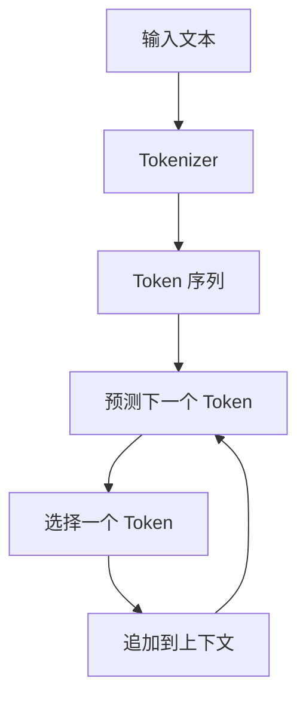
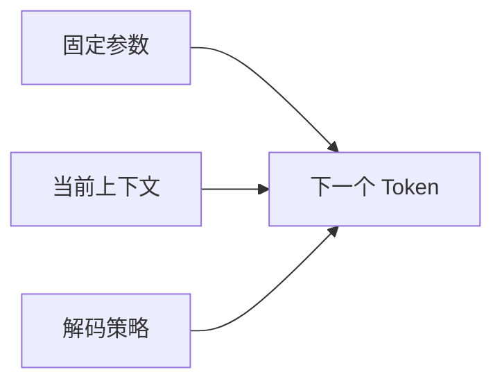

ChatGPT 能写文章、编程序、解释论文，也能解决部分数学题。

但它在底层反复执行的核心任务只有一个：

> 根据前面的 Token，预测下一个 Token。

听起来像“自动补全”，为什么最后会表现出知识、推理甚至工具使用能力？

这篇文章先建立理解 LLM 最重要的心智模型。

## 一、自动补全为什么能走到“智能”？

如果只看单步，LLM 做的事情确实很像自动补全：读入一串 Token，给出下一个 Token 的概率分布，再从中选出一个。

真正值得追问的是：当这种预测在海量文本上训练，并连续循环数百或数千次后，会发生什么？

先把一次生成拆开看：



新 Token 会被追加到上下文，成为下一轮预测的输入。模型并不是一次生成整篇文章，而是在循环中逐步形成完整回答。

后面所有看似复杂的能力，都建立在这个简单机制之上。

## 二、Token 是什么？

Token 是模型处理文本的基本单位。

它可能是：

- 一个汉字
- 一个英文单词
- 一个子词
- 一个标点
- 一个空格加单词
- 一段代码
- 一组 UTF-8 字节

例如：

```text
大语言模型很强大
```

可能被转换为：

```text
["大", "语言", "模型", "很", "强大"]
```

然后再转换为整数：

```text
[243, 1987, 3201, 92, 4587]
```

神经网络真正接收的是这些整数对应的向量。

## 三、模型究竟预测什么？

假设训练文本为：

```text
The sky is blue
```

它可以产生多个训练任务：

```text
The              → sky
The sky          → is
The sky is       → blue
```

数学上，模型学习：

```math
P(x_t\mid x_1,x_2,\ldots,x_{t-1})
```

意思是：已经看到前面所有 Token 后，下一个 Token 出现的概率是多少。

模型不会只输出一个候选，而是输出整个词表上的概率分布。

| 候选 Token概率 |      |
| -------------- | ---- |
| blue           | 0.71 |
| clear          | 0.09 |
| dark           | 0.05 |
| green          | 0.01 |
| 其他           | 0.14 |

解码器再根据 Temperature、Top-p 等策略，从概率分布中选择一个 Token。

## 四、为什么简单目标能产生复杂能力？

为了预测小说的下一段，模型需要追踪人物、事件、语气和叙事结构。

为了预测程序的下一行，模型需要学习语法、变量依赖、API 使用方法和常见算法。

为了预测论文的下一句，模型需要学习术语、事实、公式和论证方式。

预测目标虽然简单，但要在大量不同文本上持续做好，模型就必须形成越来越复杂的内部表示。

## 五、模型是如何获得知识的？

模型不会把互联网文档原封不动地存进参数。

训练过程会不断调整数十亿个数值，让正确 Token 在对应上下文中获得更高概率。

知识因此以分布式、压缩和近似的方式存在于参数中。

这更像一种有损压缩，而不是传统数据库。

## 六、LLM 不是搜索引擎

没有外部工具时，模型不会自动搜索互联网。

它只能使用：

1. 训练参数中的统计知识。
2. 当前上下文中的信息。
3. 已经生成的 Token。

如果产品支持搜索，搜索也是模型之外的工具。

模型要先生成搜索请求，再读取搜索结果并继续回答。

## 七、LLM 不是传统数据库

数据库存储明确记录，例如：

```text
用户 ID：1024
城市：台北
订单数：37
```

LLM 的参数不会以这种可直接查询的形式保存事实。

模型擅长概括、解释和组合模式，却可能在具体日期、数字、引用和罕见事实上犯错。

所以，语言模型和数据库解决的是不同问题。

## 八、模型真的“理解”吗？

如果把理解定义为“内部形成能支持预测、迁移和组合的表示”，那么大模型显然具有一定程度的理解。

如果把理解定义为“拥有与人类相同的意识、体验和意图”，目前没有充分证据支持这种结论。

更实用的问题不是争论模型是否真正理解，而是判断：

- 它在哪些任务上可靠？
- 哪些结果可以验证？
- 哪些任务需要工具？
- 哪些决策必须由人负责？

## 九、为什么同一个问题会得到不同答案？

模型输出的是概率分布，而不是唯一答案。

如果系统进行随机采样，同一个 Prompt 可以选择不同 Token。

第一个 Token 的差异会改变后续上下文，最终形成完全不同的回答。

这也是模型具有创造力和不稳定性的共同来源。

## 十、最重要的心智模型

不要把 LLM 想象成一个坐在屏幕后、先想好答案再打字的人。

更准确的模型是：



每一步输出都由固定参数、当前上下文和解码策略共同决定。

## 本篇总结

1. LLM 的核心任务是预测下一个 Token。
2. Token 是模型处理信息的基本单位。
3. 模型输出的是概率分布，不是唯一答案。
4. 知识以分布式、压缩的方式存在于参数中。
5. 复杂能力来自大规模预测任务施加的学习压力。
6. LLM、搜索引擎和数据库是不同组件。
