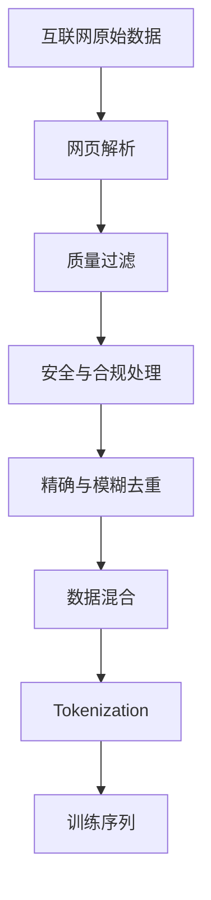

> 《LLM 从零到一》系列第 2/8 篇

训练大模型并不是把互联网下载下来，再扔进 GPU。

原始网页充满广告、模板、乱码、复制内容和低质量文本。

真正困难的是建立一条数据生产线，把混乱的互联网变成适合学习的 Token 序列。

## 一、先走一遍数据流水线

一张网页从被抓取到进入训练，并不会直接从浏览器跳进 GPU。它要先经历解析、筛选、去重、配比和切分，最后才成为模型能读取的 Token 序列。

这条流水线可以概括为：



这意味着，模型能力不只取决于参数量。数据质量、领域比例、重复程度和 Tokenizer，都会改变模型最后学到什么、擅长什么。

## 二、训练数据从哪里来？

常见数据来源包括：

- 普通网页
- Wikipedia
- 新闻与博客
- 论坛和问答网站
- 书籍与论文
- GitHub 等代码仓库
- 数学资料
- 授权数据集
- 人工整理数据

不同数据来源承担不同作用。

代码帮助模型学习程序结构，书籍提供长距离叙事，论文提供专业知识，论坛则包含真实问题和非正式表达。

## 三、为什么原始网页不能直接训练？

网页抓取结果通常包含：

- HTML 标签
- 导航栏
- 广告
- Cookie 提示
- 评论模板
- SEO 关键词
- 乱码
- 重复转载
- 恶意内容
- 隐私信息

如果直接训练，模型会把这些低质量模式一起学进去。

大模型公司的核心资产之一，就是数据清洗和混合管线。

## 四、网页解析

网页解析负责从 HTML 中识别真正的内容。

系统需要判断：

- 哪部分是标题？
- 哪部分是正文？
- 哪部分是代码？
- 哪部分是表格？
- 哪部分是导航？
- 哪部分应该删除？

解析错误会导致训练文本残缺，或充满网站模板和无意义按钮文字。

## 五、质量过滤

质量过滤会尝试判断文档是否值得用于训练。

常见检查包括：

- 语言是否自然
- 内容是否完整
- 信息密度是否足够
- 是否为关键词堆积
- 是否存在大量重复句
- 是否为自动生成垃圾
- 是否包含危险内容

过滤不是越严格越好。

过度过滤可能误删小众语言、独特表达和非主流知识。

## 六、为什么必须去重？

同一篇文章可能被数百个网站转载。

代码仓库可能被大量 Fork，新闻可能被聚合站重复复制，网页模板也可能出现在数百万页面中。

如果不去重，会产生三个问题。

第一，算力被浪费在重复样本上。

第二，少量重复文本会扭曲训练分布。

第三，模型更容易记住文本，并导致评测数据泄漏。

## 七、精确去重与模糊去重

精确去重用于删除完全相同的文本。

模糊去重用于识别只有标题、日期或少量句子不同的近似文档。

模糊去重更困难，因为系统不能简单地把所有相似文章都删除。

两篇文章可能讨论相同事件，却包含不同观点和信息。

## 八、数据混合决定能力结构

不同领域的数据不能简单按原始数量混合。

普通网页数量巨大，如果完全按自然比例训练，数学、代码和高质量书籍可能被淹没。

训练团队需要人为设定不同来源的采样比例。

| 数据类型可能增强的能力 |                      |
| ---------------------- | -------------------- |
| 代码                   | 编程、结构化推理     |
| 数学                   | 计算、证明与问题分解 |
| 书籍                   | 长文、叙事和稳定文风 |
| 论文                   | 专业知识与论证       |
| 问答                   | 问题理解与回答格式   |
| 网页                   | 广泛知识与语言覆盖   |

数据混合本质上是在分配模型的学习预算。

## 九、什么是 Tokenizer？

神经网络不能直接处理文字。

Tokenizer 会把文本切分成有限词表中的 Token，再把 Token 转换成整数 ID。

```text
"Large language model"
        ↓
["Large", " language", " model"]
        ↓
[17485, 4221, 1646]
```

模型真正接收的是 Token ID 对应的向量。

## 十、BPE 如何建立词表？

BPE 可以从字节或字符开始。

系统统计哪些相邻片段经常共同出现，再把高频组合合并成新 Token。

```text
l o w e r
lo w e r
low e r
low er
lower
```

这个过程不断重复，直到词表达到预定大小。

## 十一、词表大小的权衡

| Token 单位优点缺点 |                  |                |
| ------------------ | ---------------- | -------------- |
| 字节               | 任意文本都能表示 | 序列很长       |
| 字符               | 字符操作直观     | 多语言集合复杂 |
| 子词               | 效率与泛化平衡   | 字符边界被隐藏 |
| 整词               | 常见句子序列短   | 词表巨大       |

较大的词表可以缩短序列，却会扩大输入和输出层。

较小的词表更通用，却会增加上下文长度和计算成本。

## 十二、为什么 Tokenizer 会影响能力？

模型不是在人类眼中的字词上计算，而是在 Token 上计算。

如果一个单词被编码成较大的子词，模型就不容易直接看到其中的字母。

这会影响：

- 拼写
- 字母计数
- 字符串反转
- 精确字符限制
- 长整数逐位运算

## 十三、中文 Tokenization 的特殊问题

中文没有天然空格分词。

一个 Token 可能是单个汉字、多个常见汉字组合，或 UTF-8 字节片段。

如果中文在 Tokenizer 训练语料中的比例较低，同一段中文可能需要更多 Token。

这会影响上下文利用率、推理成本和生成速度。

## 十四、上下文窗口是什么？

上下文窗口表示模型一次计算最多能够看到多少 Token。

它不是永久记忆，也不等于字符数或字数。

同样一段内容，使用不同 Tokenizer，消耗的 Token 数可能不同。

## 十五、如何形成训练样本？

清洗后的文档会被转换成 Token 序列。

训练程序从序列中抽取不同长度的窗口，让模型预测每个位置的下一个 Token。

```text
输入：[x1, x2, x3, x4]
目标：[x2, x3, x4, x5]
```

一个长序列可以同时提供大量监督信号。

## 常见误区

### 误区一：训练数据越多越好

大量垃圾数据可能降低训练效率，甚至污染模型行为。

规模必须与质量、覆盖和去重共同考虑。

### 误区二：Token 就是单词

Token 可能是字、子词、标点、空格或字节。

它不是自然语言中的固定词语单位。

### 误区三：上下文长度等于模型记忆

上下文只是当前计算可见的信息。

参数记忆、产品记忆和上下文窗口属于不同机制。

## 本篇总结

1. 原始互联网不能直接用于训练。
2. 数据必须经过解析、过滤、去重和混合。
3. 数据比例会改变模型的能力结构。
4. Tokenizer 把文字转换成整数 ID。
5. BPE 在词表大小和序列长度之间折中。
6. Tokenization 会影响成本、拼写和多语言表现。
